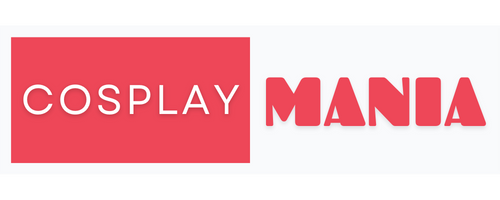
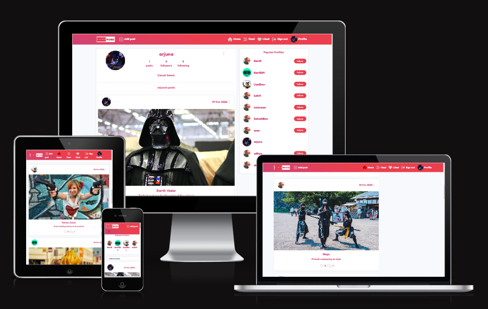
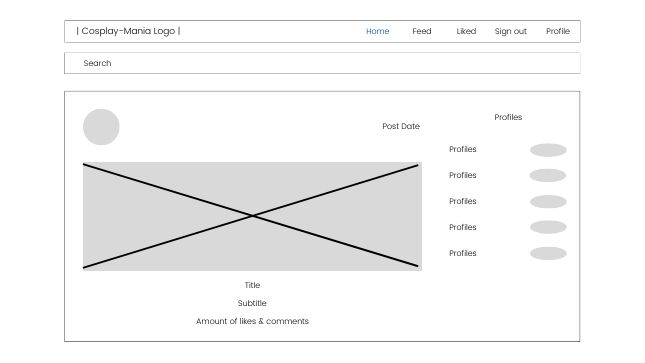
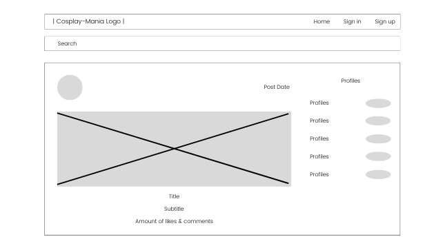
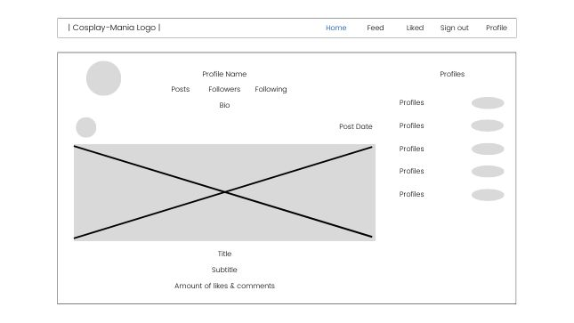
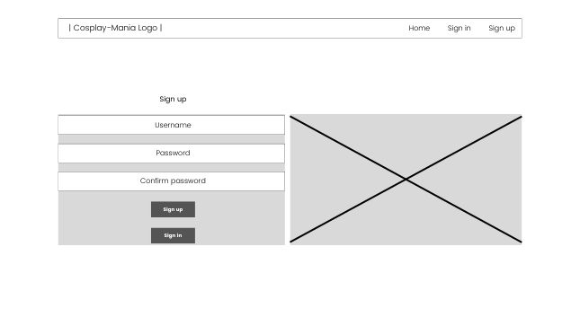
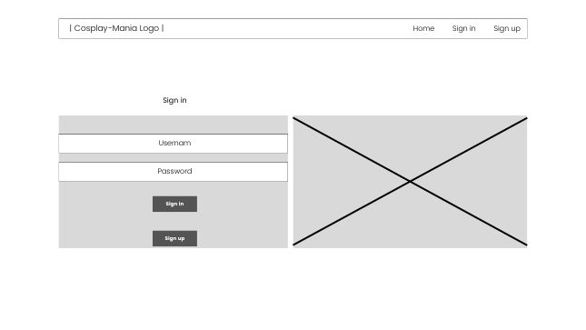
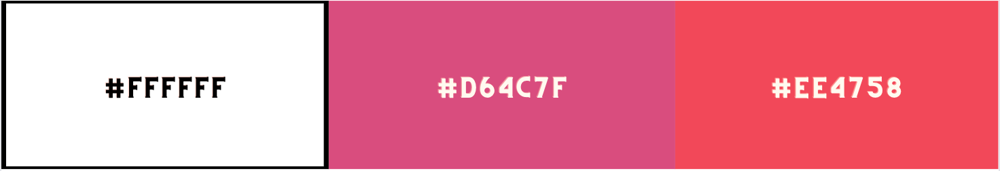

# Cosplay Mania

Welcome to Cosplay Mania!

Cosplay Mania is a photo-sharing platform for the wonderful world of cosplay! Users can share their latest and most unique cosplaying experiences through posts, as well as interact with each other through like, comment, and follow functionalities. This is the frontend repository of the React-powered Cosplay Mania project. The backend repository of the project can be accessed [HERE](https://github.com/Lapratomo24/drf-api).

[Deployed API](https://react-project-5.herokuapp.com/)

[Deployed Site](https://cosplay-mania.herokuapp.com/)

## Objective

Cosplay Mania is a photo-sharing platform that is targeted for a specific audience: those who love to cosplay! Whether you love dressing up as your favorite superhero, anime character, or a real-life figure, everybody is welcome to visit Cosplay Mania and share their greatest experiences cosplaying during specific events or for personal hobby. A user can sign up and then login to be able to create and share their post(s) with everyone else. They will also be able to give likes and comments to any other posts belonging to other users, though they may also comment on their post(s). These posts may be updated or deleted as desired. The user can follow another user to be able to see new posts specific to them on the user's feed. Any liked posts will also show up on a specific liked page for the user to repeated viewing. Last but not least, the user can update their profile picture and bio if they wish to do so.

## User Experience

### Agile Methodology

GitHub Projects was used to set up a [Kanban Board](https://github.com/users/Lapratomo24/projects/10/views/1?layout=board) in order to plan and develop the project.
[GitHub Issues](https://github.com/Lapratomo24/cosplay-mania/issues) present the complete rundown of the project phases.

### User Stories

There are 30 issues, or in other words, User Stories that were planned and documented as the project was being developed in order to achieve the desired result. These issues were then further classified as 4 main Epics as follows.

**Epic - Navigation**
- As a user, I'd like to be able to view the navigation bar on every page so that I can navigate different pages of the site.
- As a user, I'd like to be able to keep scrolling through the content on the site so that I don't need to click on 'next page' etc.

**Epic - Authentication**
- As a user, I'd like to be able to create my own account so that I can access all features available for signed-up users.
- As a user, I'd like to be able to sign in so that I can access functionality for logged-in users.
- As a user, I'd like to be able to tell whether I'm logged in or not so that I can log in or log out anytime.
- As a user, I'd like to be able to maintain my logged-in status so that my user experience is not compromised.
- As a user, I'd like to be able to sign out so that I'd be the only user of my own account and be able to prevent other user(s) from accessing it.

**Epic - Post**
- As a user, I'd like to be able to create a post so that I can share my art with other users.
- As a user, I'd like to be able to like a post belonging to other users so that I can show support for those posts.
- As a user, I'd like to be able to click on a post so that I can view the post details and comments.
- As a user, I'd like to be able to like a post belonging to other users so that I can show support for those posts.
- As a user, I'd like to be able to view posts I liked so that I can always find my favorite posts.
- As a user, I'd like to be able to use keywords on a search bar so that I can search for posts that interest me.
- As a user, I'd like to be able to view posts belonging to other users I follow so that I can keep up to date with all their posts.
- As a user, I'd like to be able to edit my own post so that I can update the post content.
- As a user, I'd like to be able to delete my own post so that I can remove outdated content.

**Epic - Comment**
- As a user, I'd like to be able to add comments to a post so that I can share my thoughts about the post.
- As a user, I'd like to be able to see how long ago a comment was posted so that I can tell how old a comment is.
- As a user, I'd like to be able to view comments on each post so that I can tell others' thoughts on the posts.
- As a user, I'd like to be able to edit my comment so that I can update my existing comment.
- As a user, I'd like to be able to delete my comment so that I can control the removal of my own comment from the app.

**Epic - Profile**
- As a user, I'd like to be able to view a profile page so that I can learn more about a particular user.
- As a user, I'd like to be able to create and see my user avatar image so that others and myself can identify my profile.
- As a user, I'd like to be able to see avatars belonging to other users so that I can identify their profiles based on the avatars.
- As a user, I'd like to be able to view a list of the most-followed user profiles so that I can see which ones are popular.
- As a user, I'd like to be able to view statistics about a specific user so that I can learn more about them.
- As a user, I'd like to be able to follow and/or unfollow other users so that I can see/unsee posts belonging to them on the homepage.
- As a user, I'd like to be able to view all posts by a specific user so that I can be up-to-date with their latest posts.
- As a user, I'd like to be able to edit my profile so that I can always update it.
- As a user, I'd like to be able to update my username and password so that I can change my display name and keep my profile secure.

## Design

Due to both strict time constraints and my little understanding of the React module as a whole, I had little choice but to develop a website that practically follows the same design and concept as the Moments tutorial project.

### Logo

I created the Cosplay-Mania logo, seen at the top of this readme file, on [Canva](https://www.canva.com/).

### Wireframes

**Homepage, Feed, Likes Pages - Logged in**

**Homepage, Feed, Like Pages, Logged out**

**Profile Page**

**Signup Page**

**Signin Page**

### Color Scheme

I picked the following colors as I felt that pink-reddish colors would fit the theme of the website.

### Font

I use [Fredoka-One](https://fonts.google.com/specimen/Fredoka+One) as the font family for the website.

### Images 

Images seen on the posts come from [Pexels](https://www.pexels.com/) and [Unsplash](https://unsplash.com/) via the keyword "cosplay".

## Features

