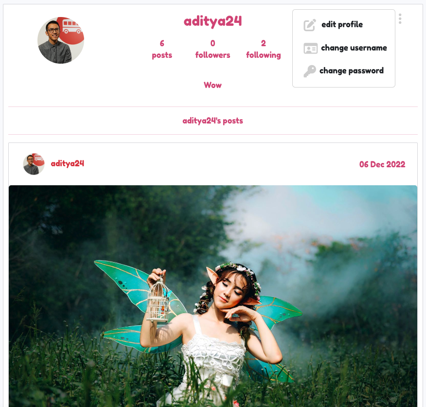

# Cosplay Mania

Welcome to Cosplay Mania!

Cosplay Mania is a photo-sharing platform for the wonderful world of cosplay! Users can share their latest and most unique cosplaying experiences through posts, as well as interact with each other through like, comment, and follow functionalities. This is the frontend repository of the React-powered Cosplay Mania project. The backend repository of the project can be accessed [HERE](https://github.com/Lapratomo24/drf-api).

[Deployed API](https://react-project-5.herokuapp.com/)

[Deployed Site](https://cosplay-mania.herokuapp.com/)

## Objective

Cosplay Mania is a photo-sharing platform that is targeted for a specific audience: those who love to cosplay! Whether you love dressing up as your favorite superhero, anime character, or a real-life figure, everybody is welcome to visit Cosplay Mania and share their greatest experiences cosplaying during specific events or for personal hobby. A user can sign up and then login to be able to create and share their post(s) with everyone else. They will also be able to give likes and comments to any other posts belonging to other users, though they may also comment on their post(s). These posts may be updated or deleted as desired. The user can follow another user to be able to see new posts specific to them on the user's feed. Any liked posts will also show up on a specific liked page for the user to repeated viewing. Last but not least, the user can update their profile picture and bio if they wish to do so.

## User Experience

### Agile Methodology

GitHub Projects was used to set up a [Kanban Board](https://github.com/users/Lapratomo24/projects/10/views/1?layout=board) in order to plan and develop the project.
[GitHub Issues](https://github.com/Lapratomo24/cosplay-mania/issues) present the complete rundown of the project phases.

### User Stories

There are 30 issues, or in other words, User Stories that were planned and documented as the project was being developed in order to achieve the desired result. These issues were then further classified as 4 main Epics as follows.

**Epic - Navigation**
- As a user, I'd like to be able to view the navigation bar on every page so that I can navigate different pages of the site.
- As a user, I'd like to be able to keep scrolling through the content on the site so that I don't need to click on 'next page' etc.

**Epic - Authentication**
- As a user, I'd like to be able to create my own account so that I can access all features available for signed-up users.
- As a user, I'd like to be able to sign in so that I can access functionality for logged-in users.
- As a user, I'd like to be able to tell whether I'm logged in or not so that I can log in or log out anytime.
- As a user, I'd like to be able to maintain my logged-in status so that my user experience is not compromised.
- As a user, I'd like to be able to sign out so that I'd be the only user of my own account and be able to prevent other user(s) from accessing it.

**Epic - Post**
- As a user, I'd like to be able to create a post so that I can share my art with other users.
- As a user, I'd like to be able to like a post belonging to other users so that I can show support for those posts.
- As a user, I'd like to be able to click on a post so that I can view the post details and comments.
- As a user, I'd like to be able to like a post belonging to other users so that I can show support for those posts.
- As a user, I'd like to be able to view posts I liked so that I can always find my favorite posts.
- As a user, I'd like to be able to use keywords on a search bar so that I can search for posts that interest me.
- As a user, I'd like to be able to view posts belonging to other users I follow so that I can keep up to date with all their posts.
- As a user, I'd like to be able to edit my own post so that I can update the post content.
- As a user, I'd like to be able to delete my own post so that I can remove outdated content.

**Epic - Comment**
- As a user, I'd like to be able to add comments to a post so that I can share my thoughts about the post.
- As a user, I'd like to be able to see how long ago a comment was posted so that I can tell how old a comment is.
- As a user, I'd like to be able to view comments on each post so that I can tell others' thoughts on the posts.
- As a user, I'd like to be able to edit my comment so that I can update my existing comment.
- As a user, I'd like to be able to delete my comment so that I can control the removal of my own comment from the app.

**Epic - Profile**
- As a user, I'd like to be able to view a profile page so that I can learn more about a particular user.
- As a user, I'd like to be able to create and see my user avatar image so that others and myself can identify my profile.
- As a user, I'd like to be able to see avatars belonging to other users so that I can identify their profiles based on the avatars.
- As a user, I'd like to be able to view a list of the most-followed user profiles so that I can see which ones are popular.
- As a user, I'd like to be able to view statistics about a specific user so that I can learn more about them.
- As a user, I'd like to be able to follow and/or unfollow other users so that I can see/unsee posts belonging to them on the homepage.
- As a user, I'd like to be able to view all posts by a specific user so that I can be up-to-date with their latest posts.
- As a user, I'd like to be able to edit my profile so that I can always update it.
- As a user, I'd like to be able to update my username and password so that I can change my display name and keep my profile secure.

## Design

Due to both strict time constraints and my little understanding of the React module as a whole, I had little choice but to develop a website that practically follows the same design and concept as the Moments tutorial project.

### Logo

I created the Cosplay-Mania logo, seen at the top of this readme file, on [Canva](https://www.canva.com/).

### Wireframes

**Homepage, Feed, Liked Pages - Logged in**

**Homepage, Feed, Liked Pages - Logged out**

**Profile Page**

**Signup Page**

**Signin Page**

### Color Scheme

I picked the following colors as I felt that pink-reddish colors would fit the theme of the website.

### Font

I use [Fredoka-One](https://fonts.google.com/specimen/Fredoka+One) as the font family for the website.

### Images 

Images seen on the posts come from [Pexels](https://www.pexels.com/) and [Unsplash](https://unsplash.com/) via the keyword "cosplay".

## Features

**Navigation Bar**

Here the user can find the Cosplay-Mania logo which when clicked redirects them back to the homepage. On the right hand side, the user finds three navigation items: Home, Sign in, and Sign up. After logging in, the navigation bar changes state which will then display five navigation items: Home, Feed, Liked, Log out, and Profile.

**Homepage**

The landing page of Cosplay-Mania. This is where users can see all the posts shared by other users as well as themselves, and all of the available posts can be browsed by scrolling down the page as the infinite scroll feature will keep displaying the posts until the user reaches the very last post. Each post displays the number of likes and comments posted by other users. Liking a post will result in it being "stored" on the liked page.

**Owned Post**

Every post owned by a logged-in user has an ellipsis button on the top right, which when clicked will give the option to the user to edit or delete the post.

**Search Bar**

The homepage, feed, and liked pages all feature a search bar. Users can use keywords to look for a specific post or posts of a specific user.

**Following**

The right hand side displays popular users which can be followed or unfollowed by the logged-in user. Posts by followed users are then displayed on the feed page. 

**Add Post**

Logged-in users can click on the add post button next to the Cosplay-Mania logo to create and share a post. They only need to provide an image, a title for the post, and some text content.

**Profile**

This page is where a logged-in user is redirected to when clicking the avatar on the right side of the navbar. Here they can see how many posts they already share, the amount of users they follow, and the amount of users who follow them back. They can write a short bio if they wish to do so, under which all of their posts are displayed. The ellipsis button give the user the ability to edit their profile as well as update their username and password.

**404**

## Testing

### HTML

HTML code shows no particular errors that needed fixing.

### CSS

CSS code passed the validation test with flying colors.

### JavaScript

JS code has some necessary errors, particularly may have something to do with JSX syntax. But eveything seems to be fine as most of them are directly taken from the Moments walkthrough.

### Lighthouse

Lighthouse validation was run across all pages of the website in order to check performance, accessibility, best practices, and SEO, and the results are quite nice.

## Future Features

In the future, once I understand React a little bit more, I would like to implement more models and features into the project, such as implementing events with map, private messaging feature for users, and more.

## Bugs

No bugs in particular was encountered other than some React Bootstrap syntax that needed adjustments.

## Technologies

### Languages

- JSX
- HTML
- CSS
- JavaScript
- React Bootstrap

### Programs

- [Heroku](https://www.heroku.com/): Cloud platform used for the project deployment that lets companies build, deliver, monitor and scale apps.
- [GitHub](https://github.com/): Code hosting platform for version control and collaboration.
- [Gitpod](https://www.gitpod.io/): An IDE to create and develop this project.
- [Cloudinary](https://cloudinary.com): End-to-end image and video hosting solution for websites and mobile apps.
- [Figma](https://www.figma.com/): A collaborative web application for interface design.
- [Google Fonts](https://fonts.google.com/): Font generator.
- [Canva](https://www.canva.com/): Online graphic design tool.
- [Unsplash](https://unsplash.com/): For cosplay images.
- [Pexels](https://www.pexels.com/): For cosplay images.
- [AmIResponsive](https://ui.dev/amiresponsive): To check for site responsiveness across various devices.

## Deployment

For this final milestone project, Heroku is used for the deployment of the application.

1. After logging in, click the New button on the top right.
2. From the dropdown, click Create new app.
3. Type in a relevant name, choose your region, thne click Create app button.
5. Go to Resources tab, and type in Postgres under add-ons to select Heroku Postgres.
6. Go to Settings tab and click Config Vars button, then add and fill in all the necessary fields to connect the API and the frontend.
7. Before deployment, make sure to set DEBUG to False.
8. Now go to Deploy tab and choose GitHub as your Deployment method.
9. Connect to GitHub by clicking the Search button and choosing the correct repository.
10. You can now choose between Enable Automatic Deploys or manually deploy the application via Deploy Branch. After Heroku finishes building the application, you can click the View button to launch and run your terminal on a new tab.

**GitHub**

Forking the Repository:

- Locate the repository.
- Locate the 'Fork' button on the right side of the page. Clicking the button results in the creation of a copy of the repository.
- The copy is now found in your GitHub account.

Cloning the Repository:

- Locate the repository.
- Click the 'Code' button to the left of the green 'Gitpod' button.
- Copy the link under HTTPS by clicking the clipboard icon.
- Open Git Bash.
- Change the current working directory to the location where you want the cloned directory to be made.
- Type git clone and then paste the copied link form GitHub.
- Pressing 'Enter' will result in the creation of the local clone.

## Credits and Acknowledgements

As I mentioned in the other Readme file for the backend, this final project is perhaps the most difficult learning experience I've ever had since I decided to learn how to code more than one year ago. It's safe to say that I did not manage to comprehend the inner workings of React and therefore found myself relying 100% on the Moments walkthrough for both the backend and frontend parts of this project. So I would like to say thank you to CodeInstitute for the guidance to get me through this difficult period. I am also grateful to the tutors who helped me during the difficulties I faced during the creation of this project. And of course, this would also not have been possible if not for the guidance, instructions, and recommendations I received from my mentor [Akshat Garg](https://www.linkedin.com/in/akshatnitd/).

Thank you for the past one year!

---

Looking forward to my Diploma! (fingers crossed that I do not fail this project)
